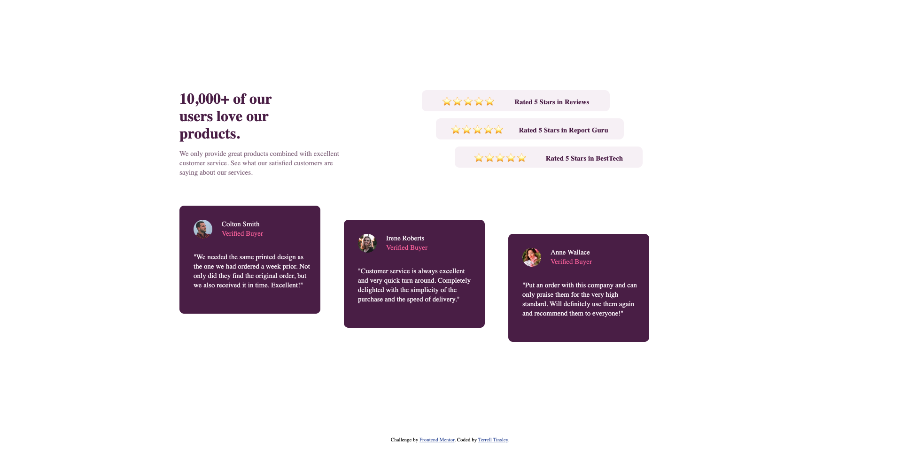
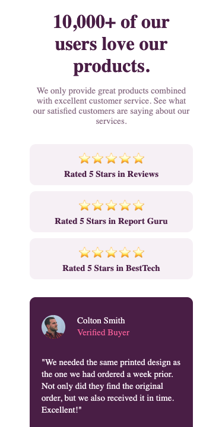
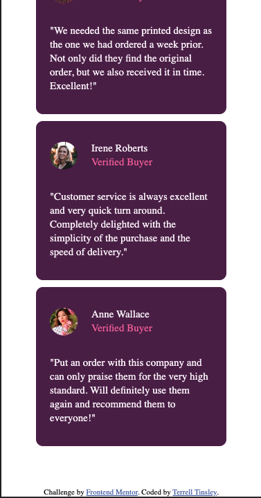

# Frontend Mentor - Social proof section solution

## Table of contents

- [Overview](#overview)
  - [The challenge](#the-challenge)
  - [Screenshot](#screenshot)
- [My process](#my-process)
  - [Built with](#built-with)
  - [What I learned](#what-i-learned)
- [Author](#author)

## Overview


### The challenge

Users should be able to:

- View the optimal layout for the section depending on their device's screen size

### Screenshot

desktop view -> 
mobile one view -> 
mobile two view -> 

## My process

First I always start by removing all the default margin and padding and setting the box-sizing to border-box, for every object. This provides a clean design and allows me to create the page exactly how the clients wants. 
```css
* {
  padding: 0;
  margin: 0'
  box-sizing: border-box;
}
```

Next I start by creating the clients mobile layout. Once I have the mobile view perfected, I then add the font styles, font weights, font size, color and background color to the elements. 

Once I have the mobile and the styling exactly how the client wants, I then focus on getting the desktop view perfect. It is important that every time a change is made to the desktop view that I go back and make sure the mobile view is still perfect. 

Once I finshed everything, I like to step away for a few hours and come back to tripple check everything with a fresh set of eyes. 

### Built with

- Semantic HTML5 markup
- CSS custom properties
- Flexbox
- CSS Grid
- Mobile-first workflow

### What I learned

I learned that you can not style a  <br> tag. for the review-name section, I first tried to change the color by editing the <p> then the <br> 
``` html
  <p class="review-name">Colton Smith<br>Verified Buyer<</p>
```
``` css
  .review-profile  p {
        /* styling the name of the reviewer */
        color: hsl(300, 24%, 96%);
      }
      .review-profile br {
        /* styling the verfied buyer  */
        color: hsl(333, 80%, 67%);
      }
```

This does not work as you can not style a <br> instead you must do it like below.

``` html
  <p class="review-name">Colton Smith<br><span>Verified Buyer</span></p>
```
``` css
  .review-profile  p {
        /* styling the name of the reviewer */
        color: hsl(300, 24%, 96%);
      }
      .review-profile span {
        /* styling the verfied buyer  */
        color: hsl(333, 80%, 67%);
      }
```

Not really something that I learned but it was pretty fun doing, was on the desktop view. Creating the stair stepper look on the star-reviews-cont and the written-reviews-cont

```css
   /* styling star reviews */
        #star-reviews-cont {
          flex-basis: 50%;
        }
        .reviews {
          display: flex;
          width: 400px;
          justify-content: space-evenly;
        }
        .reviews:nth-of-type(1){
          margin-left: -60px;
          margin-bottom: 15px;
        }
        .reviews:nth-of-type(2){
          margin-left: -30px;
          margin-bottom: 15px;
        }
        .reviews:nth-of-type(3){
          margin-left: 10px;
        }

        /* styling written reviews */
        #written-reviews-cont {
          display: flex;
          flex-wrap: wrap;
        }
        .written-reviews {
         flex-basis: 24%;        
         padding: 30px 30px;
         width: 300px; 
         height: 230px;
        }
        .written-reviews:nth-of-type(2){
          margin-top: 60px;
          margin-left: 50px;
        }
        .written-reviews:nth-of-type(3) {
          margin-top: 90px;
          margin-left: 50px;
        }
        .written-reviews p {
          width: 250px;
        }
```

I did learn the use of the display:flex; flex-wrap; on the parent container and then using flex-basis: 50%; on the child elements to easily space the elements within the parent container. This is a much easier way of doing it and also gives a cleaner look and feel.  

## Author

- Website - [Terrell Tinsley](https://www.ttinsley.dev)
- Frontend Mentor - [@TRellTins](https://www.frontendmentor.io/profile/trelltins)
- Twitter - [@trelltinsley](https://www.twitter.com/trelltinsley)

